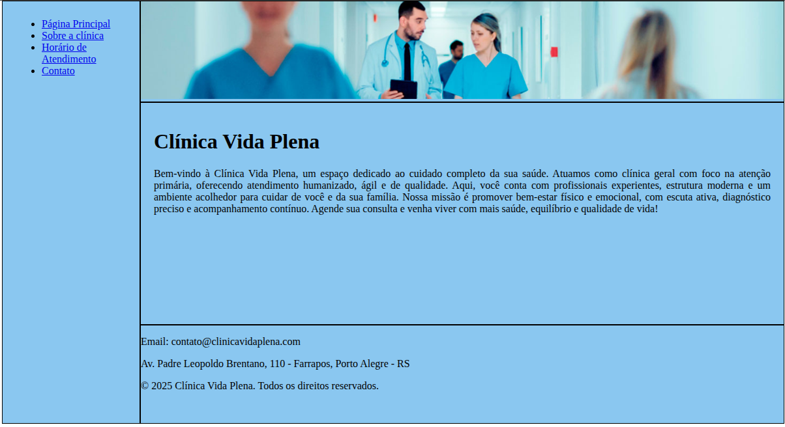

<h1><strong>First Site With HTML</strong></h1>

<h2><strong>Descrição</strong></h2>

  O objetivo foi criar um site estático de uma clínica médica fictícia, aplicando todos os conhecimentos adquiridos sobre estrutura HTML, organização de páginas, tabelas, formulários, mídias e navegação entre links.

<h2><strong>Funcionalidades</strong></h2>
<ul>
  <li align="justify">Site estático composto por múltiplas páginas (página inicial, sobre, contato e horários).</li>
  <li align="justify">Menu de navegação funcional entre todas as páginas.</li>
  <li align="justify">Tabela de horários de atendimento organizada com foco em clareza e leitura.</li>
  <li align="justify">Formulário de contato completo, incluindo campos de entrada e botões de envio e limpeza.</li>
  <li align="justify">Seção de localização da clínica utilizando Google Maps incorporado via <strong>iframe</strong>.</li>
</ul>

<h2><strong>Demonstração do Projeto</strong></h2>

  
   
  <a href="https://williandpg.github.io/first-site-with-html/" target="_blank"><strong>Acesse a demonstração</strong></a>

<h2><strong>Tecnologias Utilizadas</strong></h2>
<ul>
  <li align="justify">
    <a href="https://developer.mozilla.org/pt-BR/docs/Web/HTML"><strong>HTML</strong></a>: Linguagem de marcação principal usada para a construção das páginas.
  </li>
  <li align="justify">
    <a href="https://code.visualstudio.com/"><strong>VS Code</strong></a>: Editor utilizado para desenvolvimento.
  </li>
  <li align="justify">
    <a href="https://developers.google.com/maps/documentation/embed/get-started?hl=pt-br"><strong>Google Maps Embed</strong></a>: Utilizado para exibir a localização da clínica.
  </li>
  <li align="justify">
    <a href="https://developer.mozilla.org/pt-BR/docs/Learn_web_development/Extensions/Forms/How_to_structure_a_web_form"><strong>Formulários HTML</strong></a>: Referência para estruturação do formulário de contato.
  </li>
</ul>

<h2><strong>Estrutura do Projeto</strong></h2>

A estrutura do projeto é organizada da seguinte forma:

<pre><code>
/
├── images/
│    ├── contato.png
│    ├── horario.png
│    ├── pagina-principal.png
│    ├── sobre.png
├── base.css
├── contato.html
├── horario.html
├── index.html
├── sobre.html
├── README.md
</code></pre>

<h2><strong>Contato</strong></h2>

  <strong>Willian Gonçalves</strong> | 
  <a href="https://www.linkedin.com/in/williandpg/" target="_blank"><strong>LinkedIn</strong></a> | 
  <a href="https://github.com/williandpg" target="_blank"><strong>Github</strong></a> | 
  <a href="https://williandpg.github.io/" target="_blank"><strong>Portfólio</strong></a> | 
  <a href="mailto:goncalves.wdp@outlook.com" target="_blank"><strong>Email</strong></a>

<h2><strong>Créditos</strong></h2>

  Este projeto foi desenvolvido como parte da Formação HTML da DIO.

  
🇺🇸 <strong>English Version</strong>

  <h1><strong>First Site With HTML</strong></h1>

  <h2><strong>Description</strong></h2>
  

    The objective was to create a static website for a fictitious medical clinic, applying all the knowledge acquired about HTML structure, page organization, tables, forms, media and navigation between links.
  

  <h2><strong>Features</strong></h2>
  <ul>
    <li align="justify">Static website composed of multiple pages (home, about, contact and schedule).</li>
    <li align="justify">Functional navigation menu between all pages.</li>
    <li align="justify">Schedule table built with focus on readability and clarity.</li>
    <li align="justify">Contact form implemented with all required fields, including submit and clear buttons.</li>
    <li align="justify">Clinic location section using Google Maps embedded via <strong>iframe</strong>.</li>
  </ul>

  <h2><strong>Project Demonstration</strong></h2>
  

    
     
    <a href="https://williandpg.github.io/first-site-with-html/" target="_blank"><strong>Access the demo</strong></a>
  

  <h2><strong>Technologies Used</strong></h2>
  <ul>
    <li align="justify">
      <a href="https://developer.mozilla.org/pt-BR/docs/Web/HTML"><strong>HTML</strong></a>: Main markup language used to build the pages.
    </li>
    <li align="justify">
      <a href="https://code.visualstudio.com/"><strong>VS Code</strong></a>: Editor used for development.
    </li>
    <li align="justify">
      <a href="https://developers.google.com/maps/documentation/embed/get-started?hl=pt-br"><strong>Google Maps Embed</strong></a>: Used to display the clinic location.
    </li>
    <li align="justify">
      <a href="https://developer.mozilla.org/pt-BR/docs/Learn_web_development/Extensions/Forms/How_to_structure_a_web_form"><strong>HTML Forms</strong></a>: Reference for structuring the contact form.
    </li>
  </ul>

  <h2><strong>Project Structure</strong></h2>
  
The project structure is organized as follows:

  <pre><code>
  /
  ├── images/
  │    ├── contato.png
  │    ├── horario.png
  │    ├── pagina-principal.png
  │    ├── sobre.png
  ├── base.css
  ├── contato.html
  ├── horario.html
  ├── index.html
  ├── sobre.html
  ├── README.md
  </code></pre>

  <h2><strong>Contact</strong></h2>
  

    <strong>Willian Gonçalves</strong> | 
    <a href="https://www.linkedin.com/in/williandpg/" target="_blank"><strong>LinkedIn</strong></a> | 
    <a href="https://github.com/williandpg" target="_blank"><strong>GitHub</strong></a> | 
    <a href="https://williandpg.github.io/" target="_blank"><strong>Portfolio</strong></a> | 
    <a href="mailto:goncalves.wdp@outlook.com" target="_blank"><strong>Email</strong></a>
  

  <h2><strong>Credits</strong></h2>
  

    This project was developed as part of DIO's HTML Training.
  

